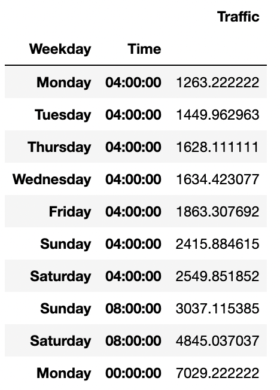
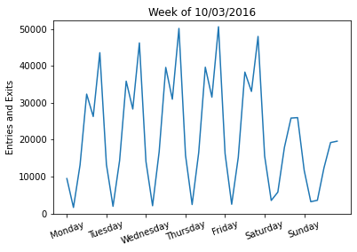

## Construction Work on MTA System at the Lexington Ave / 59 St Subway Station
By: Rachel Goodridge

### Abstract
Through interpretation of MTA Turnstile Data for the Lexington Ave/59th Street subway station in Manhattan, an optimal time for closing this station for Huff construction company to complete some repairs was determined. Data was ingested using SQLite and processed in Python with pandas. Results showed the least amount of traffic at the station on average occurs between midnight and 4am on weekdays, and thus, this would be a good time to close the station to complete the work.

### Design
This project arose from the need for interpretation of [MTA Turnstile Data](http://web.mta.info/developers/turnstile.html) in New York City. Huff construction company was hired to complete some repairs on the Lexington Avenue/59th Street subway station entrance in Manhattan. The work is long overdue, as it hasn't been renovated since October of 1973 and the tiles on the walls are cracked and falling off into the stairwell. However, the BMT Broadway Line is particularly busy, and this station complex is the fourteenth-busiest in the system, so the company will want to reduce the traffic impact on the rest of the line as much as possible. They will need to close the station during repairs for a total of 16 non-consecutive hours and plan to do their work sometime during the month of October 2021. The goal is to determine the best days/times for Huff construction workers to close the station in order to minimize the number of travelers who are displaced.

### Data
The data can be publicly accessed through the MTA website [here](http://web.mta.info/developers/turnstile.html) and is presented in text files. Files contain cumulative entrances and exits through each turnstile at each station in the system roughly every four hours. Files are grouped by week and within each file, turnstiles can be grouped by unique combinations of Remote Unit, Control Area, and Station Name Key. 

### Algorithms
First, MTA turnstile data was ingested into a SQL database for each October in 2015-2020. Then, it was queried in Python using SQLAlchemy to retrieve all October dates (as well as September 30th) and it was filtered using Pandas to only include the Lexington Ave/59 St station. Next, data was converted from cumulative numbers to new entrances and exits by subtracting the previous values. Finally, all entries and exits at each date/time were combined. 

### Tools
- SQL and SQLite
- Python and Jupyter Notebook
- packages - sqlalchemy, pandas, numpy, datetime, and matplotlib.pyplot

### Communication
The time block from 12am to 4am had the least amount of traffic on average. The days of the week, Sunday and Saturday, also had the smallest averages. However, grouping the data by day of the week and then by time shows that the 12-4am time slot on any weekday would be best (better than 12-4am on Saturday or Sunday, interestingly - see table below for averages). Zooming in on a particular week of any given October, it is easy to see that weekdays have more extreme highs and lows (but especially highs) than weekends. While people are more likely to be using the subway during weekdays than on weekends in general, late night hours on the weekends are a bit more popular than late night hours during the week (see plot below). Conducting this same investigation on traffic at stations 5 AV/59 ST (aka 5 AVE-59 ST) which is to the west, 51 ST which is to the south, and LEXINGTON AV/63 which is to the north, showed similar patterns. In summary, choosing to close the Lexington Avenue/59th Street station during the 12am to 4am time block on weekdays would be not only the best time for this particular station, but also a good time for surrounding stations to accommodate the displaced traffic.

